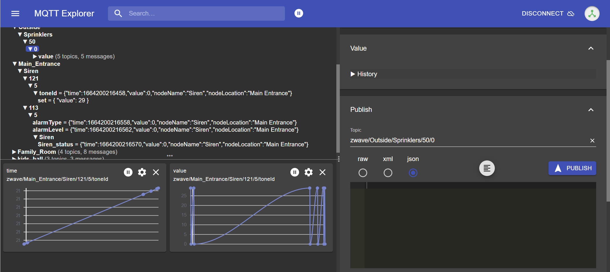
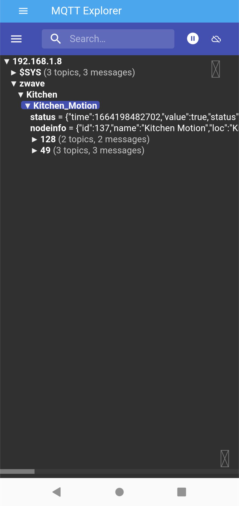

# Home Assistant Addon: MQTT Explorer 
This addon lets you use MQTT Explorer from within Home Assistant.  

Note: It is important to use a Chromium-based browser like Chrome or Edge.  Safari/iOS has a known bug which prevents operation.

If you like this, and want to see more, encourage more development.

## Use
Login screen

Displaying charts of activity

Works on mobile

This addon is smeagolworm4's docker image packaged as a Home Assistant addon.
